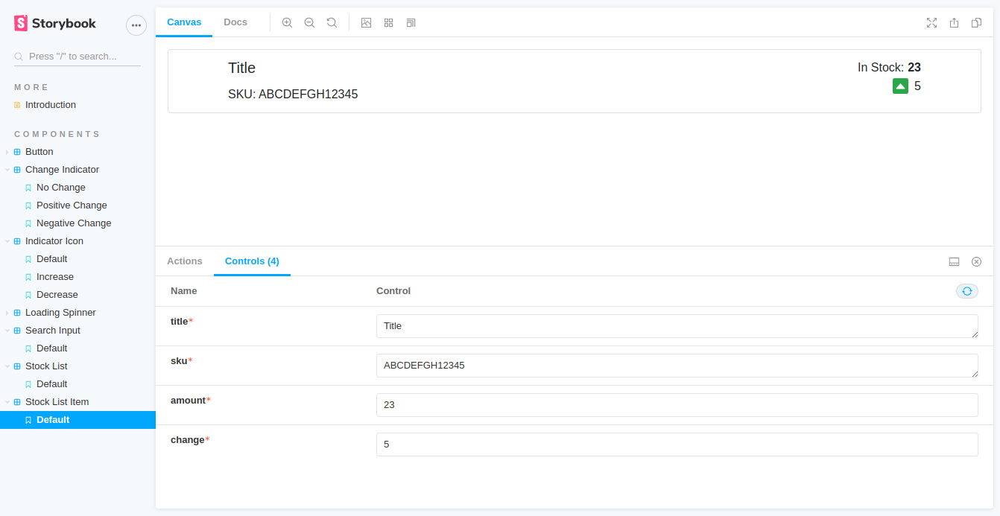

# Logistics Shop App

A simple example application which uses the following tech stack:

- [React](https://reactjs.org/)
- [Dropwizard](https://www.dropwizard.io/)
- [PostgreSQL](https://www.postgresql.org/)
- [Docker](https://www.docker.com/)

Furthermore, this example project takes advantage of the following tools:

- [Swagger](https://swagger.io/): To generate a OpenAPI based REST API documentation.

  

- [Storybook](https://storybook.js.org/): To define a simple UI components catalog.

  

## Getting started

Please check out the [backend/README](backend/README.md) and [ui/README](ui/README.md) for further information how to start the backend and frontend components.